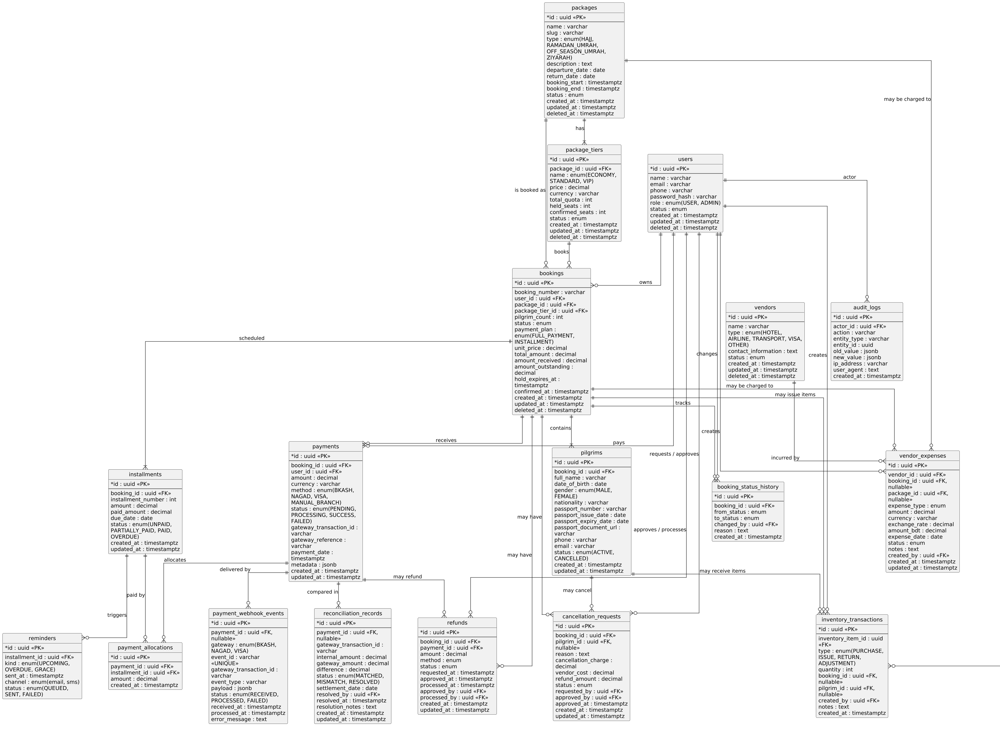

# Hajj & Umrah Booking System

End-to-end booking platform for Hajj and Umrah packages: pilgrim-facing storefront,
payment gateway (mocked for assessment), admin back-office, vendor / inventory /
reconciliation tooling.

- **`backend/`** — NestJS 11 + TypeORM + PostgreSQL REST API.
- **`frontend/`** — Next.js 16 (App Router) + React 19 + Tailwind v4.

---

## Documentation map

The brief asks for diagrams and setup documentation in the repository. They
live in their own files so each can render at full size, be deep-linked, and
be edited without merge conflicts in the README.

| What                              | Where                                                                |
| --------------------------------- | -------------------------------------------------------------------- |
| **High-level system diagram**     | [`docs/ARCHITECTURE.md`](docs/ARCHITECTURE.md)                       |
| **Database ERD** (PlantUML, hi-res) | [`docs/erd.png`](docs/erd.png) · [`docs/erd.svg`](docs/erd.svg) (renders) · [`docs/ERD.puml`](docs/ERD.puml) (source) |
| **Database ERD** (Mermaid, inline) | [`docs/ERD.md`](docs/ERD.md)                                         |
| **Gap analysis & design Q&A**     | [`docs/GAP_ANALYSIS.md`](docs/GAP_ANALYSIS.md)                       |
| **Manual end-to-end testing**     | [`docs/MANUAL_TESTING_GUIDE.md`](docs/MANUAL_TESTING_GUIDE.md)        |



The three design questions the brief explicitly asks the README to answer
live at the bottom of this file in [Design answers](#design-answers).

---

## Quick start

**Docker is the only prerequisite.** `make` and `./scripts/dev` are optional
shortcut wrappers around `docker compose` — use them if you have them
installed, ignore them otherwise.

### Option A — One command from the repo root (recommended)

The simplest possible path. Two commands, no flags, no helpers required:

```bash
# 1. Boot the entire stack (postgres + redis + backend + frontend)
docker compose up -d --build

# 2. Seed the demo users
docker compose exec backend npm run seed
```

Once `docker compose ps` reports everything `healthy`, open
http://localhost:3000 and sign in:

| Role    | Email                  | Password    | Where to sign in                                    |
| ------- | ---------------------- | ----------- | --------------------------------------------------- |
| Pilgrim | `pilgrim@example.com`  | `User123!`  | http://localhost:3000/login → `/dashboard`          |
| Admin   | `admin@hajj.gov.bd`    | `Admin123!` | http://localhost:3000/login → `/admin`              |

The seeder is **idempotent** — re-running it does not change the passwords.
To reset, drop the database volume and seed again:

```bash
docker compose down -v
docker compose up -d --build
docker compose exec backend npm run seed
```

### Option B — Dev stack with hot reload

Same as Option A, but with `docker-compose.dev.yml` layered on top so source
edits are picked up live (no rebuild). Use this when you'll be editing code.

```bash
docker compose -f docker-compose.yml -f docker-compose.dev.yml up
# (in another terminal)
docker compose -f docker-compose.yml -f docker-compose.dev.yml exec backend npm run seed
```

`docker-compose.dev.yml` adds:

- Bind-mounts of `backend/src/`, `frontend/app/`, etc. into the running
  containers.
- The lightweight `dev` build stage (no TS compile in the image; the
  container runs `nest start --watch` / `next dev` directly).
- An anonymous volume on `/app/node_modules` so the container's installed
  deps aren't shadowed by the host.

`docker compose build` is only needed when `package.json` or a `Dockerfile`
changes. Pure code edits never require a rebuild.

### Option C — `make` shortcut

If you have `make` installed:

```bash
make dev          # Option B equivalent
make seed         # seed the demo users
```

### Option D — `./scripts/dev` (bash helper, no `make`)

A single self-contained shell script that mirrors the Makefile:

```bash
./scripts/dev up      # same as `make dev`
./scripts/dev seed    # same as `make seed`
./scripts/dev logs    # tail backend + frontend logs
./scripts/dev down    # stop the dev stack
```

Works on any POSIX shell with Docker installed.

### Option E — Run without Docker

Requires a local Postgres 16 + Redis 7 reachable on `localhost`:

```bash
# backend
cd backend
npm install
npm run start:dev

# frontend (in another terminal)
cd ../frontend
npm install
echo "NEXT_PUBLIC_API_BASE_URL=http://localhost:3001/api/v1" > .env.local
npm run dev
```

Then `cd backend && npm run seed` to populate the demo users.

### Useful Make / `./scripts/dev` targets

If you went with Option C (Make) or Option D (bash helper), these are the
shortcuts you'll use day-to-day. Both expose the same command set.

```bash
make help              # show every available target
make dev               # start dev stack (hot reload)
make dev-build         # rebuild images after changing package.json
make seed              # seed demo users into the dev database
make logs              # tail backend + frontend logs
make logs-backend      # tail backend logs only
make logs-frontend     # tail frontend logs only
make shell-backend     # open a shell in the backend container
make shell-frontend    # open a shell in the frontend container
make shell-postgres    # open psql against the dev database
make ps                # list running containers
make restart           # restart app containers without dropping the DB
make erd               # regenerate docs/erd.png + docs/erd.svg
make rebuild-deps      # nuke and rebuild images from scratch (no cache)
make reset             # ⚠  stop everything, drop volumes (deletes DB)
make prod              # build & start the multi-stage production stack
```

### Service URLs

| Service       | URL                            |
| ------------- | ------------------------------ |
| Frontend      | http://localhost:3000          |
| Backend API   | http://localhost:3001/api/v1   |
| PostgreSQL    | `localhost:5432`               |
| Redis         | `localhost:6379`               |

### How it works

- **`postgres` / `redis`** — health-checked dependencies; names match those
  referenced by the backend's env (`postgres`, `redis`).
- **`backend`** — built from `backend/Dockerfile` (3-stage). Env vars in
  `backend/.env.docker` are loaded via `env_file`. `DATABASE_URL` and
  `REDIS_URL` override the env file to use the Docker service names.
  `NODE_ENV=development` is forced via the compose file so TypeORM doesn't
  require SSL on the local Postgres container (the backend's own
  `database.config.ts` enables SSL only in production).
- **`frontend`** — built from `frontend/Dockerfile` (3-stage, Next.js
  standalone). Env vars in `frontend/.env.docker` are inlined into the JS
  bundle at build time. `NEXT_PUBLIC_API_BASE_URL=http://localhost:3001/api/v1`
  is correct because the browser runs on the host (not inside the container
  network).

---

## Project layout

```
.
├── backend/               # NestJS API
│   ├── src/               # modules: auth, packages, tiers, bookings, …
│   ├── docker-compose.yml # standalone API stack (postgres + redis + backend)
│   └── Dockerfile
├── frontend/              # Next.js app
│   ├── app/               # routes (App Router)
│   ├── components/        # shared UI primitives
│   ├── lib/api/           # API client + endpoint wrappers + snake→camel normalize
│   ├── contexts/          # AuthContext
│   ├── Dockerfile
│   └── .env.docker
├── docker-compose.yml     # full stack: postgres + redis + backend + frontend
├── docker-compose.dev.yml # dev override — bind mounts, hot reload (used by `make dev`)
├── Makefile               # convenience targets: `make dev`, `make prod`, `make logs`, …
└── scripts/
    └── dev                # drop-in shell-script equivalent of the Makefile (no `make` needed)
```

---

## Prerequisites

- **Docker 24+** with `docker compose` v2 — required for Options A–D
  (everything except the no-Docker Option E).
- **Node.js 20 LTS** (18.18+ also works; Node 20 is the tested baseline) —
  only required for Option E (running on the host without Docker).
- **Make** *(optional)* — every Make target has a `./scripts/dev` equivalent,
  so you don't need `make` installed to run Option D.
- Ports `3000` (frontend), `3001` (backend API), `5432` (Postgres) and `6379`
  (Redis) must be free on the host when running the full stack.

---

## Design answers

These three questions are required by the assessment brief. Short answers
here, full reasoning and diagrams in [`docs/ARCHITECTURE.md`](docs/ARCHITECTURE.md).

### 1. How do you prevent overselling a seat under concurrent bookings?

Booking creation runs inside a single PostgreSQL transaction that takes
`SELECT … FOR UPDATE` on the `package_tiers` row first (TypeORM
`pessimistic_write`). Any concurrent booking blocks on that row, recomputes
`available = total_quota − held_seats − confirmed_seats`, rejects with
`409 INSUFFICIENT_SEATS` if the requested `pilgrim_count` exceeds it, and
otherwise increments `held_seats` and inserts the booking, pilgrims and
installments in the same transaction. Held seats are released by the
`expire-seat-holds` scheduler once `hold_expires_at` passes. See
`backend/src/bookings/bookings.service.ts`.

### 2. How do you handle a duplicate or out-of-order payment webhook?

Three layers of idempotency: `payment_webhook_events.event_id` is `UNIQUE`
(a second delivery returns `200 OK` without re-processing); payment
state transitions are guarded (`SUCCESS` cannot regress to `PENDING`); and
payment-allocations to installments are keyed on `installments.id` so the
same payment cannot double-allocate. A late webhook that targets an
already-terminal payment is acknowledged but never mutates state. See
`backend/src/payments/payments.service.ts`.

### 3. How do you keep reporting fast at 5 million users?

Three layers: (a) paginated, index-backed reads on the primary tables; (b)
pre-aggregated summary tables refreshed by the NestJS scheduler so
`/admin/reports/overview` is O(1) instead of re-aggregating on every
request; (c) PostgreSQL read replicas fronted by a Redis cache for hot
reads (package browsing, dashboard KPIs). PostgreSQL remains the source of
truth; the replica and Redis are never authoritative for money. Full
reasoning in `docs/ARCHITECTURE.md`.

---

## Assumptions & trade-offs

- **5M registered users ≠ 5M concurrent users.** The architecture targets the
  realistic peak of a few thousand concurrent users during the Hajj / Ramadan
  booking window.
- **Modular monolith, not microservices.** All modules (`auth`, `packages`,
  `bookings`, `payments`, `cancellation`, `refunds`, `reconciliation`,
  `vendors`, `inventory`, `report`, `audit`, `scheduler`) live in a single
  NestJS process with one PostgreSQL primary. Splitting into services only
  earns its complexity when measured load, organizational scale or
  compliance demands it. See `docs/ARCHITECTURE.md` §"Microservices — yes or
  no?".
- **Money values are server-side.** The client never tells the server how much
  a booking costs, what status a payment is in, or what a refund should be.
  `tier.price` is captured at booking creation (`bookings.unit_price`) so that
  later admin changes to tier pricing do not retroactively change historical
  bookings.
- **Soft delete only on financial records.** Nothing financial is ever
  hard-deleted; reports still query deleted rows and reconciliation works.
- **Webhooks are the source of truth for payment success.** The client
  redirect is not trusted; only an authenticated webhook that passes the
  gateway signature check and the `event_id` idempotency check can mark a
  payment `SUCCESS`.
- **Manual branch payments must be approved by a different admin** from the
  one who recorded them (segregation of duties). Settled as `PENDING_APPROVAL`
  until an independent approver acts.
- **Gateway mismatches are never auto-corrected.** They become
  `reconciliation_records.status = MISMATCH`; only an admin can mark them
  `RESOLVED` and the action is audited.
- **Real payment gateways are abstracted.** The assessment ships a mock
  gateway; production swap-in is behind the same `PaymentsService.create`
  interface.

