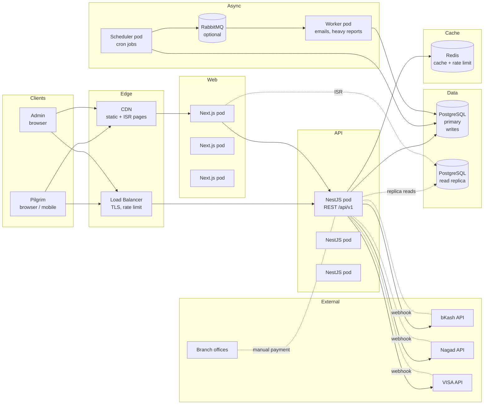
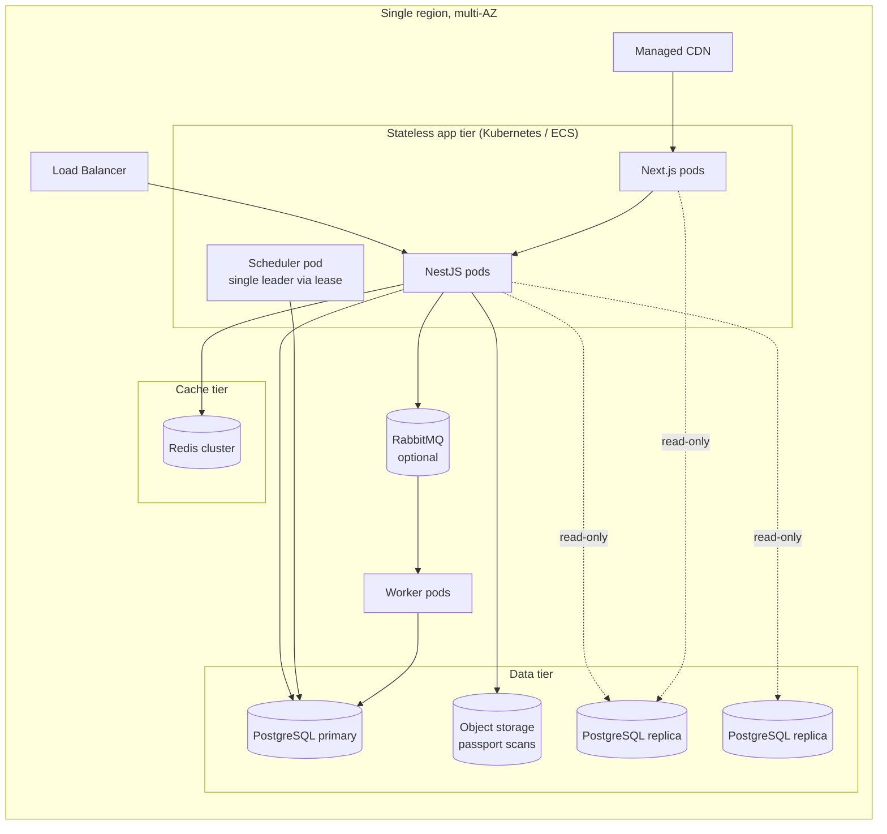

# Architecture — Hajj & Umrah Booking System

This document answers the **Part 2 — System Design** deliverable from the
assessment. It is intentionally short, opinionated, and grounded in the code
that is actually committed.

- High-Level System Diagram
- Database ERD (link out to `ERD.md`)
- "Do I need microservices for 5M users?" — short answer **no**, with reasoning
- Detailed answers to the three design questions the README is required to
  cover
- Read-side scaling plan that keeps reports fast at 5M users
- A production target topology (what the system becomes once traffic demands
  it)

---

## 1. High-Level System Diagram

The diagram below is the **target production topology**. The shipped
assessment code already runs the *core path* (NestJS API + PostgreSQL + Redis
+ Next.js); the workers, read replica, replicas, CDN and gateway adapters
are the additions you would make when traffic demands them, not prerequisites
for the brief.



### What each box means in the assessment scope

| Box                | In assessment code? | Notes                                                                                |
| ------------------ | ------------------- | ------------------------------------------------------------------------------------ |
| CDN                | no                  | Use a managed CDN in production; not needed for the assessment.                       |
| Load Balancer      | no                  | Single Node process behind Nginx / Docker compose port mapping is enough for review. |
| Next.js pods       | yes                 | Single container for dev; horizontally scalable because stateless.                    |
| NestJS pods        | yes                 | Single container for dev; same story.                                                |
| PostgreSQL primary | yes                 | Source of truth.                                                                     |
| PostgreSQL replica | no                  | Add when read traffic justifies it; the report endpoint reads from it.               |
| Redis              | yes                 | Already wired in docker-compose for cache + rate limit.                              |
| Scheduler          | yes                 | `backend/src/scheduler` runs the cron jobs in-process.                               |
| Workers + RabbitMQ | no                  | Optional. The brief marks them as future scaling options, not requirements.          |
| Gateway adapters   | yes (mock)          | Real adapters are pluggable behind the same `PaymentsService.create` interface.      |

### Modular monolith layout

Inside the NestJS API:

```
backend/src/
├── auth/           ← registration, login, JWT
├── user/           ← user CRUD for admin
├── packages/       ← package + tier CRUD + seat quota
├── bookings/       ← booking + seat reservation + pilgrims
├── installments/   ← installment schedule + allocation
├── payments/       ← payment intent, mock gateway, webhooks, reconciliation
├── cancellation/   ← cancellation request + approval flow
├── refunds/        ← refund request → approval → processing
├── reconciliation/ ← settlement import + mismatch resolution
├── vendors/        ← vendor CRUD
├── inventory/      ← inventory items + transactions
├── report/         ← admin reports
├── audit/          ← audit logs
├── scheduler/      ← cron jobs (expire holds, overdue installments, …)
├── common/         ← guards, decorators, filters, interceptors
├── config/         ← env config
└── database/       ← TypeORM datasource
```

Each module owns its controllers, services, DTOs and entities. The seams are
intentionally drawn so that any module could later be lifted into its own
service without rewriting business logic — that is the only thing you actually
get from microservices that you cannot get from a modular monolith.

---

## 2. Microservices — yes or no?

**Short answer: no, not for this brief and not for the next 1–2 years of
realistic Hajj/Umrah operator traffic.**

### Why "no" is correct

1. **The number that matters is concurrent users, not registered users.**
   5 million *registered* users, even at a generous 1 % MAU-to-MAU-active ratio,
   is around 50 thousand active users in a month. Peak concurrent users during
   a Hajj booking window for a Bangladeshi operator are on the order of a few
   thousand. PostgreSQL with proper indexes and a 16-core box can serve tens of
   thousands of TPS; one well-tuned NestJS process can serve thousands of RPS.
2. **The hardest operations in this system need a single, strongly consistent
   database.** Seat reservation (`SELECT … FOR UPDATE` on `package_tiers`),
   payment confirmation (must not double-allocate), reconciliation (must not
   silently overwrite internal records), refund processing (must never exceed
   `amount_received`). Splitting these across services forces sagas,
   outbox-pattern eventual consistency and compensating transactions —
   exactly the complexity that bites you at 02:00 when two webhooks arrive in
   the wrong order.
3. **The dominant scaling axis is reads.** Browsing packages and loading
   dashboards is where traffic lives. Writes per booking are tiny and bursty.
   Reads are solved with replicas, caching and CDN — none of which require
   microservices.
4. **You already have the seams.** Each NestJS module is a folder with its
   own controller, service and entities. Extracting `payments` into its own
   service later is a packaging exercise, not a rewrite.

### When you would actually split

You split when **one** of the following is true and **measured**, not
guessed:

- A single team can no longer ship the whole codebase in a single deploy
  without coordination overhead (organizational scaling, not load).
- One module genuinely needs an independently scaling runtime — e.g. the
  scheduler grows into a 24/7 multi-region worker fleet.
- Compliance or tenancy forces data isolation (e.g. a separate database per
  country operator).

When that day comes, the split that pays for itself first is:

- `reports` → read-only replica + worker that owns pre-aggregated tables.
- `webhooks/payments` → a separate HTTP service that owns the gateway
  adapters, talks to the primary DB over a thin interface.
- `auth` → a hosted IdP (Auth0 / Keycloak) instead of an in-process module.

Everything else stays as one deployable.

---

## 3. Answer to the three required design questions

### Q1 — How do you prevent overselling a seat under concurrent bookings?

Every booking creation runs inside a single PostgreSQL transaction that:

1. `SELECT … FOR UPDATE` on the `package_tiers` row (TypeORM
   `lock: { mode: 'pessimistic_write' }`). Any concurrent booking for the same
   tier blocks here until the first transaction commits.
2. Computes `available = total_quota − held_seats − confirmed_seats` and
   rejects with `409 INSUFFICIENT_SEATS` if `pilgrim_count > available`.
3. Increments `held_seats` by `pilgrim_count`, creates the booking, the
   pilgrims and (when applicable) the installment schedule, all in the same
   transaction.
4. Commits.

Two simultaneous attempts on the last seat serialize on the row lock — only
one observes `available = 1`; the second observes `available = 0` and is
rejected. The held seat is released either by the
`expire-seat-holds` scheduler job once `hold_expires_at` passes, or by an
explicit cancellation/refund flow.

Quota adjustments by admins go through a separate check that
`new_quota >= held_seats + confirmed_seats`, otherwise the request is rejected
with `QUOTA_BELOW_COMMITTED_SEATS` and audited.

### Q2 — How do you handle a duplicate or out-of-order payment webhook?

Idempotency is enforced at three layers:

1. **`payment_webhook_events.event_id` is `UNIQUE`.** A second delivery with
   the same `event_id` from the gateway returns `200 OK` without re-processing
   — the financial state is not touched.
2. **State transitions are guarded.** Once a payment moves to `SUCCESS` it
   cannot regress to `PENDING` or `PROCESSING`. Specifically:
   - `PENDING → PROCESSING → SUCCESS`, or
   - `PENDING → FAILED`.
   An older webhook reporting `PENDING` for a payment that is already
   `SUCCESS` is acknowledged but does not mutate the row.
3. **Allocations are idempotent at the row level.** Payment allocation uses
   `installments.id` as the key; re-applying the same payment cannot
   double-allocate.

So a duplicated webhook is a no-op (idempotent key), a late webhook for a
payment already at terminal state is a no-op (state guard), and an
out-of-order webhook is a no-op (the older one already produced the terminal
state and cannot be undone).

### Q3 — How do you keep reporting fast at 5 million users?

Three layers, each solving a different problem:

1. **Indexed reads with pagination.** Every report endpoint filters on
   indexed columns (`bookings.status`, `payments.created_at`, `installments.due_date`,
   etc.), paginates with `LIMIT/OFFSET` capped at 100, and orders on
   whitelisted columns only. Raw aggregation against the primary tables works
   well into the low millions of rows.
2. **Pre-aggregated reporting tables refreshed by the scheduler.** Materialized
   summary tables (e.g. `report_daily_collections`, `report_seat_occupancy`)
   are rebuilt incrementally every few minutes by the NestJS scheduler. The
   `/admin/reports/overview` endpoint reads from these summaries rather than
   re-aggregating on every request — turning an O(N) query into O(1).
3. **Read replicas + Redis cache for hot reads.** The read replica serves
   admin reports and package browsing; a short-TTL Redis cache front-sits
   package listings and the dashboard KPI block. PostgreSQL stays the source
   of truth; Redis and the replica are never authoritative for money.

Concretely:

- At 5M registered users with realistic booking counts (tens of thousands of
  bookings per package, hundreds of packages, years of installments), the
  summary tables stay in the tens of millions of rows — comfortable for
  PostgreSQL with the right indexes.
- The pilgrim-facing `/packages` endpoint is the hottest read path; it is
  served from Next.js with ISR plus Redis-backed revalidation, so the
  database rarely sees it.

---

## 4. Production target topology (what this becomes)



### Capacity planning sanity check

Assuming:

- 5M registered users.
- ~50k active bookings per year across all packages.
- ~5k peak concurrent users during the Hajj booking window.
- 1 booking + 1 payment webhook ≈ 4 writes per active booking per day.

That is on the order of 20k writes/minute peak — well within a single
PostgreSQL primary with connection pooling and SSD storage. Reads are an
order of magnitude higher and are served by the replica + CDN + Redis.

---

## 5. Non-negotiable engineering rules

These are baked into the existing code and are repeated here so the
reviewer can see them stated explicitly:

- **Money values are server-side.** The client never tells the server how
  much a booking costs, what status a payment is in, or what a refund
  should be. The server reads `tier.price`, recomputes totals and writes
  them. Frontend values are display-only.
- **Server-side gateway verification.** Payment success is only ever confirmed
  by the webhook handler after the event passes the gateway signature check
  and the `event_id` is not a duplicate. The client redirect is not
  authoritative.
- **Soft delete only on financial records.** `deleted_at` columns on every
  financial entity; reports still query deleted rows.
- **Auditable state changes.** Every mutating endpoint writes an
  `audit_logs` row with actor, action, entity, old/new value, IP and user
  agent.
- **Synchronous, transactional seat reservation.** Seat allocation never
  goes through a queue. If a queue is ever introduced, it is for
  post-booking side effects (emails, ledger postings), never the seat row.
- **No silent reconciliation.** Gateway settlement mismatches become
  `reconciliation_records.status = MISMATCH`; only an admin can mark them
  `RESOLVED`, never an automated process.

---

## 6. Where to look in the code

| Concern                           | File                                                                  |
| --------------------------------- | --------------------------------------------------------------------- |
| Seat concurrency                  | `backend/src/bookings/bookings.service.ts` (`SELECT … FOR UPDATE`)    |
| Quota guard                       | `backend/src/packages/tiers.service.ts` (adjust-quota validation)     |
| Webhook idempotency               | `backend/src/payments/payments.service.ts` (event_id UNIQUE flow)     |
| Payment state machine             | `backend/src/payments/entities/payment.entity.ts`                     |
| Installment allocation            | `backend/src/installments/installments.service.ts`                    |
| Cron: expire holds, overdue, …    | `backend/src/scheduler/scheduler.service.ts`                         |
| Reconciliation mismatch workflow  | `backend/src/payments/payments.service.ts` (import + resolve)         |
| Audit log                         | `backend/src/audit/audit.service.ts`                                  |
| IDOR / ownership guards           | `BookingsService.findOne`, `PaymentsService.findOne`                  |
| Next.js data fetching             | `frontend/lib/api/*`, ISR + Redis revalidation in `packages/page.tsx` |
