# Database ERD — Hajj & Umrah Booking System

This ERD covers every table defined in `docs/DATABASE_SCHEMA.md` and used by
the NestJS backend under `backend/src/`. It is written in Mermaid so it
renders inline on GitHub and stays in plain text (no binary diffs).

> Render check: paste the diagram below into <https://mermaid.live> if your
> Markdown viewer does not render Mermaid.

---

## Full ERD

```mermaid
erDiagram
    users ||--o{ bookings : "owns"
    users ||--o{ payments : "pays"
    users ||--o{ audit_logs : "actor"

    packages ||--|{ package_tiers : "has"
    packages ||--o{ bookings : "is booked as"
    packages ||--o{ vendor_expenses : "may be charged to"

    package_tiers ||--o{ bookings : "books"

    bookings ||--|{ pilgrims : "contains"
    bookings ||--|{ installments : "scheduled"
    bookings ||--o{ payments : "receives"
    bookings ||--o{ payment_allocations : "via"
    bookings ||--o{ cancellation_requests : "may have"
    bookings ||--o{ refunds : "may have"
    bookings ||--o{ booking_status_history : "tracks"
    bookings ||--o{ vendor_expenses : "may be charged to"
    bookings ||--o{ inventory_transactions : "may issue items"

    pilgrims ||--o{ cancellation_requests : "may cancel"
    pilgrims ||--o{ inventory_transactions : "may receive items"

    installments ||--o{ payment_allocations : "paid by"
    installments ||--o{ reminders : "triggers"

    payments ||--o{ payment_allocations : "allocates"
    payments ||--o{ payment_webhook_events : "delivered by"
    payments ||--o{ reconciliation_records : "compared in"
    payments ||--o{ refunds : "may refund"

    vendors ||--o{ vendor_expenses : "incurred by"

    inventory_items ||--o{ inventory_transactions : "moves"

    users {
        uuid id PK
        string name
        string email
        string phone
        string password_hash
        enum role "USER | ADMIN"
        enum status
        timestamptz created_at
        timestamptz updated_at
        timestamptz deleted_at "soft delete"
    }

    packages {
        uuid id PK
        string name
        string slug
        enum type "HAJJ | RAMADAN_UMRAH | OFF_SEASON_UMRAH | ZIYARAH"
        text description
        date departure_date
        date return_date
        timestamptz booking_start
        timestamptz booking_end
        enum status
        timestamptz created_at
        timestamptz updated_at
        timestamptz deleted_at
    }

    package_tiers {
        uuid id PK
        uuid package_id FK
        enum name "ECONOMY | STANDARD | VIP"
        decimal price
        string currency
        int total_quota
        int held_seats
        int confirmed_seats
        enum status
        timestamptz created_at
        timestamptz updated_at
        timestamptz deleted_at
    }

    bookings {
        uuid id PK
        string booking_number "human-readable"
        uuid user_id FK
        uuid package_id FK
        uuid package_tier_id FK
        int pilgrim_count
        enum status "PENDING_PAYMENT | PARTIALLY_PAID | CONFIRMED | EXPIRED | DEFAULTED | CANCELLED | COMPLETED"
        enum payment_plan "FULL_PAYMENT | INSTALLMENT"
        decimal unit_price "frozen at booking"
        decimal total_amount
        decimal amount_received
        decimal amount_outstanding
        timestamptz hold_expires_at
        timestamptz confirmed_at
        timestamptz created_at
        timestamptz updated_at
        timestamptz deleted_at
    }

    pilgrims {
        uuid id PK
        uuid booking_id FK
        string full_name
        date date_of_birth
        enum gender "MALE | FEMALE"
        string nationality
        string passport_number
        date passport_issue_date
        date passport_expiry_date
        string passport_document_url
        string phone
        string email
        enum status "ACTIVE | CANCELLED"
        timestamptz created_at
        timestamptz updated_at
    }

    installments {
        uuid id PK
        uuid booking_id FK
        int installment_number
        decimal amount
        decimal paid_amount
        date due_date
        enum status "UNPAID | PARTIALLY_PAID | PAID | OVERDUE"
        timestamptz created_at
        timestamptz updated_at
    }

    payments {
        uuid id PK
        uuid booking_id FK
        uuid user_id FK
        decimal amount
        string currency
        enum method "BKASH | NAGAD | VISA | MANUAL_BRANCH"
        enum status "PENDING | PROCESSING | SUCCESS | FAILED"
        string gateway_transaction_id
        string gateway_reference
        timestamptz payment_date
        jsonb metadata
        timestamptz created_at
        timestamptz updated_at
    }

    payment_allocations {
        uuid id PK
        uuid payment_id FK
        uuid installment_id FK
        decimal amount
        timestamptz created_at
    }

    payment_webhook_events {
        uuid id PK
        uuid payment_id FK "nullable until matched"
        enum gateway "BKASH | NAGAD | VISA"
        string event_id "UNIQUE"
        string gateway_transaction_id
        string event_type
        jsonb payload
        enum status "RECEIVED | PROCESSED | FAILED"
        timestamptz received_at
        timestamptz processed_at
        text error_message
    }

    reconciliation_records {
        uuid id PK
        uuid payment_id FK "nullable if gateway-only"
        string gateway_transaction_id
        decimal internal_amount
        decimal gateway_amount
        decimal difference
        enum status "MATCHED | MISMATCH | RESOLVED"
        date settlement_date
        uuid resolved_by FK
        timestamptz resolved_at
        text resolution_notes
        timestamptz created_at
        timestamptz updated_at
    }

    cancellation_requests {
        uuid id PK
        uuid booking_id FK
        uuid pilgrim_id FK "NULL = whole booking"
        text reason
        decimal cancellation_charge
        decimal vendor_cost
        decimal refund_amount
        enum status "REQUESTED | APPROVED | REJECTED | PROCESSING | COMPLETED | FAILED"
        uuid requested_by FK
        uuid approved_by FK
        timestamptz approved_at
        timestamptz created_at
        timestamptz updated_at
    }

    refunds {
        uuid id PK
        uuid booking_id FK
        uuid payment_id FK
        decimal amount
        enum method "BKASH | NAGAD | VISA | MANUAL_BRANCH"
        enum status "REQUESTED | APPROVED | PROCESSING | COMPLETED | FAILED | REJECTED"
        timestamptz requested_at
        timestamptz approved_at
        timestamptz processed_at
        uuid approved_by FK
        uuid processed_by FK
        timestamptz created_at
        timestamptz updated_at
    }

    vendors {
        uuid id PK
        string name
        enum type "HOTEL | AIRLINE | TRANSPORT | VISA | OTHER"
        text contact_information
        enum status
        timestamptz created_at
        timestamptz updated_at
        timestamptz deleted_at
    }

    vendor_expenses {
        uuid id PK
        uuid vendor_id FK
        uuid booking_id FK "nullable"
        uuid package_id FK "nullable"
        enum expense_type
        decimal amount
        string currency "e.g. SAR"
        decimal exchange_rate
        decimal amount_bdt "amount * exchange_rate"
        date expense_date
        enum status
        text notes
        uuid created_by FK
        timestamptz created_at
        timestamptz updated_at
    }

    inventory_items {
        uuid id PK
        string name
        string sku
        string unit
        int quantity
        int minimum_stock
        enum status
        timestamptz created_at
        timestamptz updated_at
        timestamptz deleted_at
    }

    inventory_transactions {
        uuid id PK
        uuid inventory_item_id FK
        enum type "PURCHASE | ISSUE | RETURN | ADJUSTMENT"
        int quantity
        uuid booking_id FK "nullable"
        uuid pilgrim_id FK "nullable"
        uuid created_by FK
        text notes
        timestamptz created_at
    }

    reminders {
        uuid id PK
        uuid installment_id FK
        enum kind "UPCOMING | OVERDUE | GRACE"
        timestamptz sent_at
        string channel "email | sms"
        enum status "QUEUED | SENT | FAILED"
    }

    audit_logs {
        uuid id PK
        uuid actor_id FK
        string action
        string entity_type
        uuid entity_id
        jsonb old_value
        jsonb new_value
        string ip_address
        text user_agent
        timestamptz created_at
    }

    booking_status_history {
        uuid id PK
        uuid booking_id FK
        enum from_status
        enum to_status
        uuid changed_by FK
        text reason
        timestamptz created_at
    }
```

---

## Cardinality summary

| Relationship                                           | Cardinality      |
| ------------------------------------------------------ | ---------------- |
| `users` → `bookings`                                   | 1..n             |
| `users` → `payments`                                   | 1..n             |
| `packages` → `package_tiers`                           | 1..n             |
| `packages` → `bookings`                                | 1..n             |
| `package_tiers` → `bookings`                           | 1..n             |
| `bookings` → `pilgrims`                                | 1..n             |
| `bookings` → `installments`                            | 1..n             |
| `bookings` → `payments`                                | 1..n             |
| `payments` → `installments` (via `payment_allocations`) | m..n             |
| `payments` → `payment_webhook_events`                  | 1..n             |
| `payments` → `reconciliation_records`                  | 1..n             |
| `payments` → `refunds`                                 | 1..n             |
| `bookings` → `cancellation_requests`                   | 1..n             |
| `pilgrims` → `cancellation_requests`                   | 0..n (nullable)  |
| `bookings` → `refunds`                                  | 1..n             |
| `vendors` → `vendor_expenses`                          | 1..n             |
| `inventory_items` → `inventory_transactions`           | 1..n             |
| `users` → `audit_logs`                                 | 0..n             |
| `bookings` → `booking_status_history`                  | 1..n             |

---

## Invariants (must always hold)

These are restated from `PROJECT_CONTEXT.md` §11 so they are visible alongside
the diagram:

- `package_tiers.held_seats + package_tiers.confirmed_seats ≤ package_tiers.total_quota`
- `package_tiers.total_quota ≥ committed_seats`
- `bookings.amount_outstanding ≥ 0`
- `bookings.amount_received ≥ 0`
- `installments.paid_amount ≤ installments.amount`
- `payment_allocations.amount ≤ available payment amount`
- For every booking: `Σ(refunds.amount) ≤ bookings.amount_received`
- `payment_webhook_events.event_id` is `UNIQUE` per gateway.